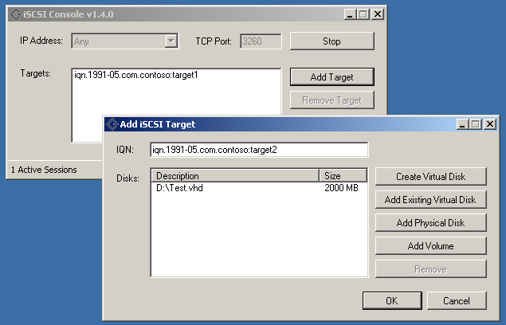

About iSCSI Console:
====================
iSCSI Console is a Free, Open Source, User-Mode iSCSI Target Server written in C#.  
iSCSI Console is cross-platform, portable and requires no installation.  
iSCSI Console can serve physical and virtual disks to multiple clients.  

About the iSCSI library:
========================
The iSCSI library utilized by iSCSI Console was designed to give developers an easy way to serve block storage via iSCSI.  
Any storage object you wish to share needs to implement the abstract Disk class, and the library will take care of the rest.  
The library was written with extensibility in mind, and was designed to fit multitude of projects.  
iSCSI Console is merely a demo project that exposes some of the capabilities of this library.  

Notes:
------
In addition to a full fledged iSCSI Target server implementation, the iSCSI library also contain a very basic iSCSI initiator implementation.

What this program can do:
===================================
1. Serve virtual disks (VHD / VMDK / IMG).
2. Serve physical disks.
3. Serve basic volumes as disks.
4. Serve dynamic volumes as disks.
5. Create VHDs.
6. Could run from Windows PE using Mono.
7. Could run from Linux / OSX using Mono (Download the Cross Platform Edition) 

Contact:
========
If you have any question, feel free to contact me.  
Tal Aloni <tal.aloni.il@gmail.com>
